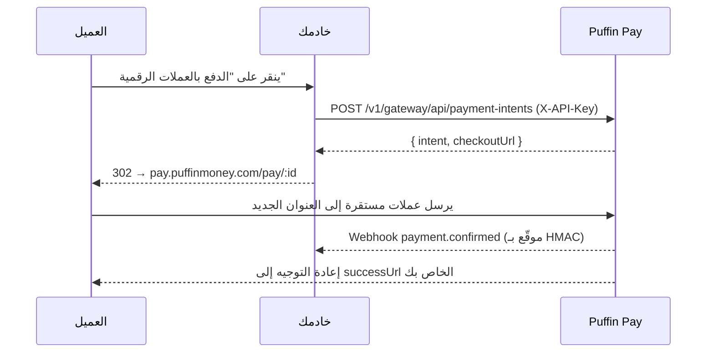

التدفق الكلاسيكي القائم على الخادم: يُنشئ خادمك الخلفي نية دفع بمفتاح API
الخاص بك، ثم يعيد توجيه العميل إلى صفحة الدفع المستضافة.

## التدفق



## أنشئ النية

```js
const res = await fetch('https://api.puffinmoney.com/v1/gateway/api/payment-intents', {
  method: 'POST',
  headers: { 'X-API-Key': process.env.PUFFIN_KEY, 'Content-Type': 'application/json' },
  body: JSON.stringify({
    amount: '99.00',
    token: 'USDC_BASE',
    chain: 'BASE',
    successUrl: 'https://yourstore.com/orders/123/thanks',
    metadata: { orderId: '123' },
  }),
});
const { intent, checkoutUrl } = await res.json();
```

## استعلم أو تحقق

```bash
GET /v1/gateway/api/payment-intents/:id   # X-API-Key
```

الحالات: `PENDING → CONFIRMED | EXPIRED | CANCELLED`. اعتمد دائمًا على
**webhook** (أو طلب GET هذا) كمصدر للحقيقة — وليس المتصفح أبدًا.

## الأصول المدعومة

جميع العملات المستقرة على جميع الشبكات التي تدعمها Puffin: Solana وEthereum
وBase وPolygon وBSC وArbitrum وOptimism وXDC — يعرض
`GET /v1/wallets/supported` المصفوفة الحالية.
