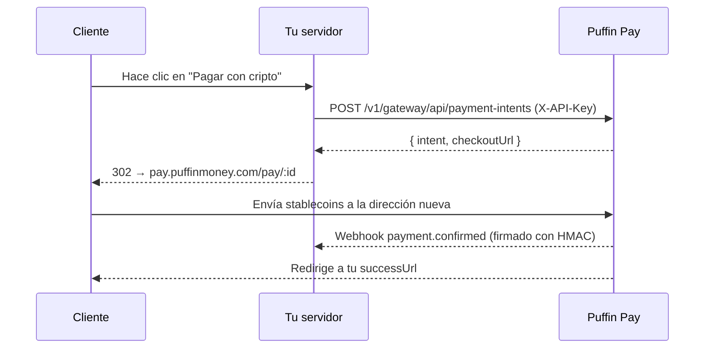

El flujo clásico controlado por servidor: tu backend crea un intent de pago
con tu API key y luego redirige al cliente a la página de checkout alojada.

## Flujo



## Crear el intent

```js
const res = await fetch('https://api.puffinmoney.com/v1/gateway/api/payment-intents', {
  method: 'POST',
  headers: { 'X-API-Key': process.env.PUFFIN_KEY, 'Content-Type': 'application/json' },
  body: JSON.stringify({
    amount: '99.00',
    token: 'USDC_BASE',
    chain: 'BASE',
    successUrl: 'https://yourstore.com/orders/123/thanks',
    metadata: { orderId: '123' },
  }),
});
const { intent, checkoutUrl } = await res.json();
```

## Consultar o verificar

```bash
GET /v1/gateway/api/payment-intents/:id   # X-API-Key
```

Estados: `PENDING → CONFIRMED | EXPIRED | CANCELLED`. Trata siempre el
**webhook** (o este GET) como la fuente de verdad — nunca el navegador.

## Activos soportados

Todas las stablecoins en todas las redes que Puffin soporta: Solana,
Ethereum, Base, Polygon, BSC, Arbitrum, Optimism, XDC —
`GET /v1/wallets/supported` muestra la matriz actual.
