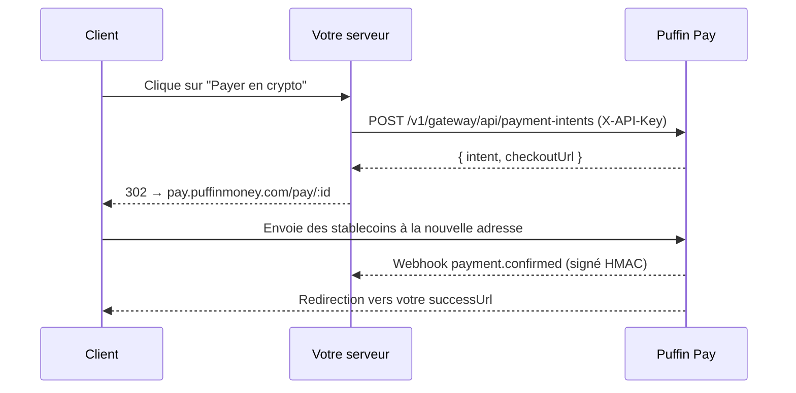

Le flux classique piloté par le serveur : votre backend crée une intention
de paiement avec votre clé API, puis redirige le client vers la page de
checkout hébergée.

## Flux



## Créer l'intention

```js
const res = await fetch('https://api.puffinmoney.com/v1/gateway/api/payment-intents', {
  method: 'POST',
  headers: { 'X-API-Key': process.env.PUFFIN_KEY, 'Content-Type': 'application/json' },
  body: JSON.stringify({
    amount: '99.00',
    token: 'USDC_BASE',
    chain: 'BASE',
    successUrl: 'https://yourstore.com/orders/123/thanks',
    metadata: { orderId: '123' },
  }),
});
const { intent, checkoutUrl } = await res.json();
```

## Interroger ou vérifier

```bash
GET /v1/gateway/api/payment-intents/:id   # X-API-Key
```

Statuts : `PENDING → CONFIRMED | EXPIRED | CANCELLED`. Considérez toujours
le **webhook** (ou ce GET) comme la source de vérité — jamais le
navigateur.

## Actifs pris en charge

Tous les stablecoins sur toutes les chaînes prises en charge par Puffin :
Solana, Ethereum, Base, Polygon, BSC, Arbitrum, Optimism, XDC —
`GET /v1/wallets/supported` liste la matrice actuelle.
