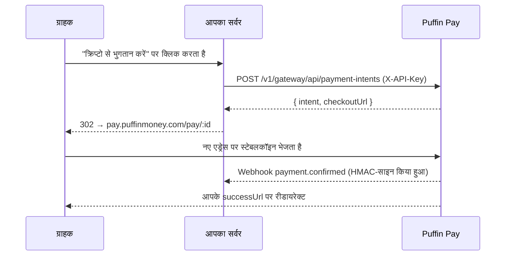

क्लासिक सर्वर-ड्रिवन फ्लो: आपका बैकएंड अपनी API key से एक पेमेंट इंटेंट बनाता
है, फिर ग्राहक को होस्टेड चेकआउट पेज पर रीडायरेक्ट करता है।

## फ्लो



## इंटेंट बनाएं

```js
const res = await fetch('https://api.puffinmoney.com/v1/gateway/api/payment-intents', {
  method: 'POST',
  headers: { 'X-API-Key': process.env.PUFFIN_KEY, 'Content-Type': 'application/json' },
  body: JSON.stringify({
    amount: '99.00',
    token: 'USDC_BASE',
    chain: 'BASE',
    successUrl: 'https://yourstore.com/orders/123/thanks',
    metadata: { orderId: '123' },
  }),
});
const { intent, checkoutUrl } = await res.json();
```

## पोल करें या वेरिफ़ाई करें

```bash
GET /v1/gateway/api/payment-intents/:id   # X-API-Key
```

स्टेटस: `PENDING → CONFIRMED | EXPIRED | CANCELLED`। हमेशा **webhook**
(या इस GET) को ही सच का स्रोत मानें — कभी भी ब्राउज़र को नहीं।

## सपोर्टेड एसेट्स

Puffin जितनी भी नेटवर्क सपोर्ट करता है उन सभी पर सभी स्टेबलकॉइन: Solana,
Ethereum, Base, Polygon, BSC, Arbitrum, Optimism, XDC — `GET
/v1/wallets/supported` वर्तमान मैट्रिक्स दिखाता है।
