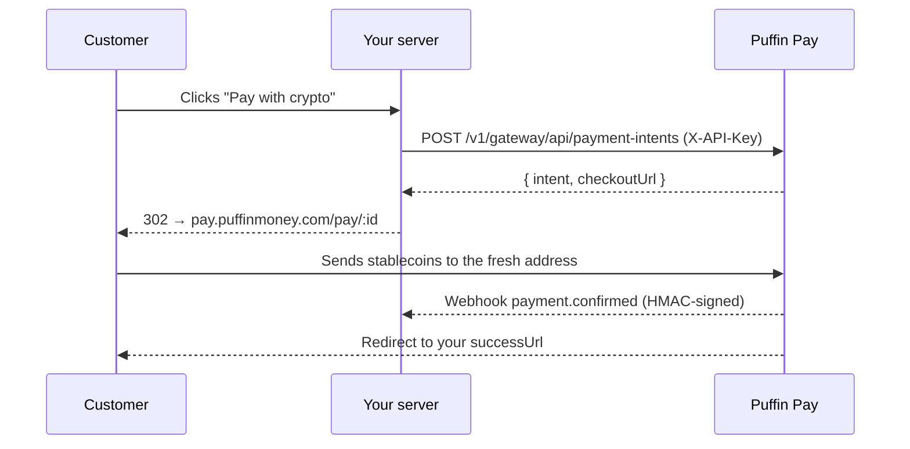

The classic server-driven flow: your backend creates a payment intent with
your API key, then redirects the customer to the hosted checkout page.

## Flow



## Create the intent

```js
const res = await fetch('https://api.puffinmoney.com/v1/gateway/api/payment-intents', {
  method: 'POST',
  headers: { 'X-API-Key': process.env.PUFFIN_KEY, 'Content-Type': 'application/json' },
  body: JSON.stringify({
    amount: '99.00',
    token: 'USDC_BASE',
    chain: 'BASE',
    successUrl: 'https://yourstore.com/orders/123/thanks',
    metadata: { orderId: '123' },
  }),
});
const { intent, checkoutUrl } = await res.json();
// checkoutUrl is absolute: https://pay.puffinmoney.com/pay/<id>
```

Add `customerEmail` to that body if you collected one — the payer then sees
it masked and can't change it. Leave it out and the checkout page asks them
for one before showing payment details, so a receipt always has somewhere to
go. Either way the payer never logs in.

## Poll or verify

```bash
GET /v1/gateway/api/payment-intents/:id   # X-API-Key
```

Statuses: `PENDING → CONFIRMED | EXPIRED | CANCELLED`. Always treat the
**webhook** (or this GET) as the source of truth — never the browser.

## Supported assets

All stablecoins on all networks Puffin supports: Solana, Ethereum, Base,
Polygon, BSC, Arbitrum, Optimism, XDC — `GET /v1/wallets/supported` lists
the current matrix.
