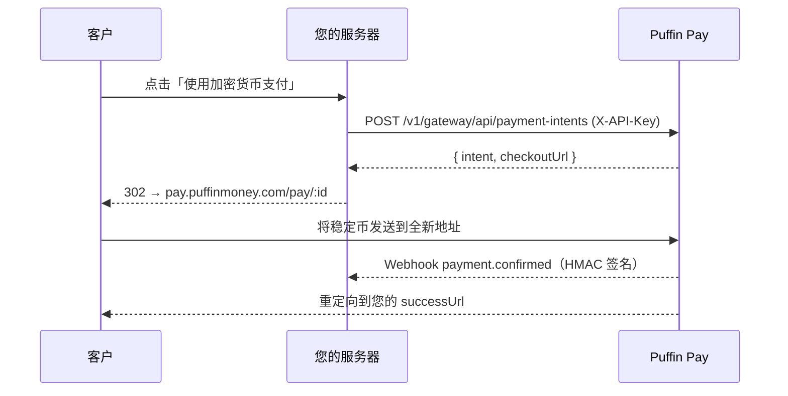

经典的服务器驱动流程：您的后端使用 API 密钥创建支付意图，然后将客户重定向到
托管结账页面。

## 流程



## 创建支付意图

```js
const res = await fetch('https://api.puffinmoney.com/v1/gateway/api/payment-intents', {
  method: 'POST',
  headers: { 'X-API-Key': process.env.PUFFIN_KEY, 'Content-Type': 'application/json' },
  body: JSON.stringify({
    amount: '99.00',
    token: 'USDC_BASE',
    chain: 'BASE',
    successUrl: 'https://yourstore.com/orders/123/thanks',
    metadata: { orderId: '123' },
  }),
});
const { intent, checkoutUrl } = await res.json();
```

## 轮询或验证

```bash
GET /v1/gateway/api/payment-intents/:id   # X-API-Key
```

状态：`PENDING → CONFIRMED | EXPIRED | CANCELLED`。始终将 **webhook**
（或此 GET 请求）作为可信来源——绝不要信任浏览器端的状态。

## 支持的资产

Puffin 支持的所有链上的所有稳定币：Solana、Ethereum、Base、Polygon、BSC、
Arbitrum、Optimism、XDC —— `GET /v1/wallets/supported` 列出当前完整矩阵。
